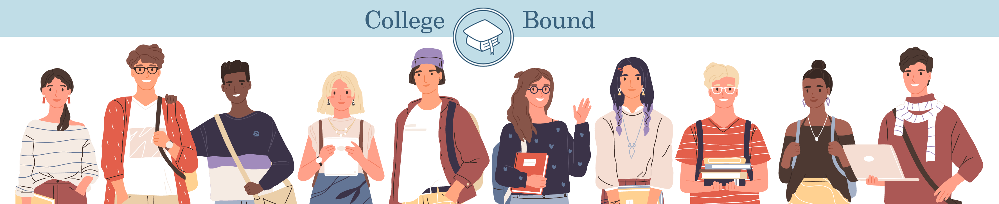

# College Bound


College Bound is a web application that aims to bridge the educational gap between first-generation college students and higher education. Despite recent improvements in accessibility in higher education, there is still more that needs to be done. This application provides plentiful information in order to make the college and financial aid application simpler.

This project was created by four members of LMU Computer Science class of 2022: Ameya Mellacheruvu, Keziah Rezaey, Elise Sawan, and Salem Tesfu. This group, known as PASTEL, is well aware of the educational inequalities that come with being first-generation students through first hand experience. They hope that their website can provide solace to prospective and current university students across the nation.

# Installation 

Use the package manager npm to install all the necessary modules to run the project.

```bash
npm install -S react-router-dom
npm install react-router-dom --save
npm install bootstrap
```

